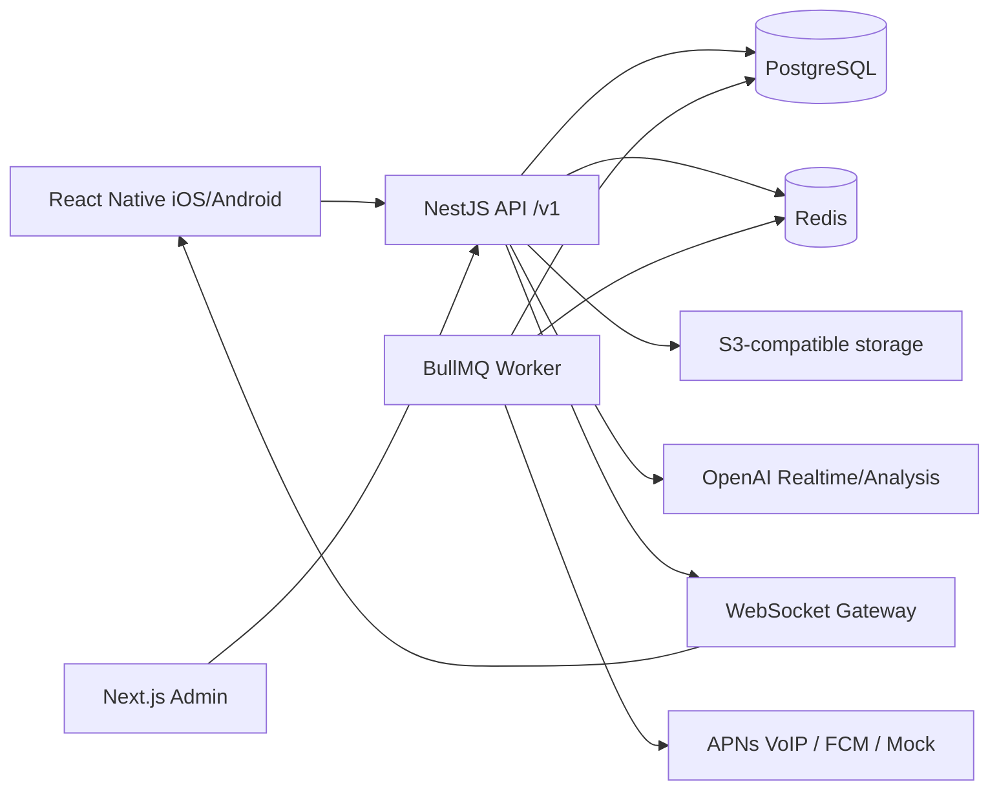
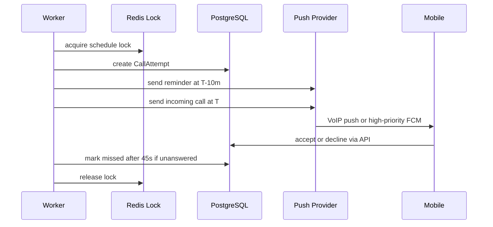
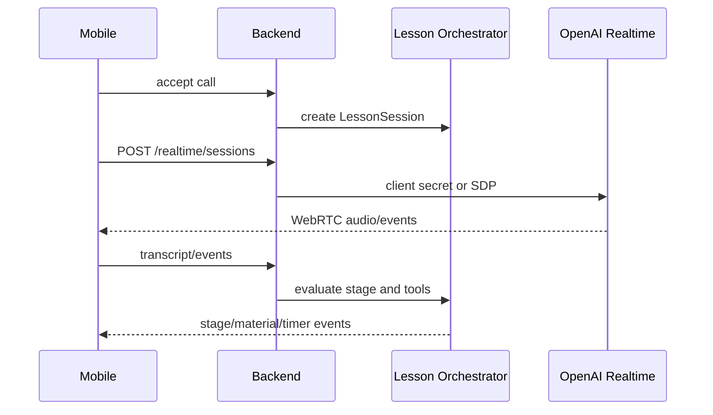

# Architecture

The API owns authoritative app, call, and lesson session state. The worker owns scheduled execution, push delivery, missed-call expiry, report jobs, and outbox dispatch. Shared contracts prevent mobile, API, worker, and admin from redefining state machines or event payloads.

Provider-specific code sits behind interfaces:

- Realtime: mock, OpenAI unified SDP, OpenAI ephemeral secret.
- Push: mock, APNs VoIP, FCM.
- Billing: mock, RevenueCat or StoreKit/Google Play adapter.
- Pronunciation: disabled, mock, Azure-compatible provider.
- Analytics and crash reporting: adapter-based Firebase/Sentry.

## Scheduled Call Sequence

## Lesson Sequence

