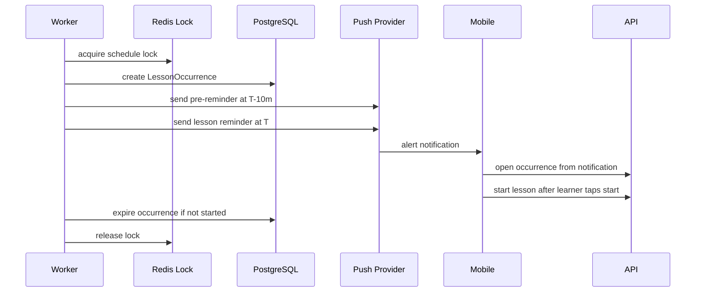
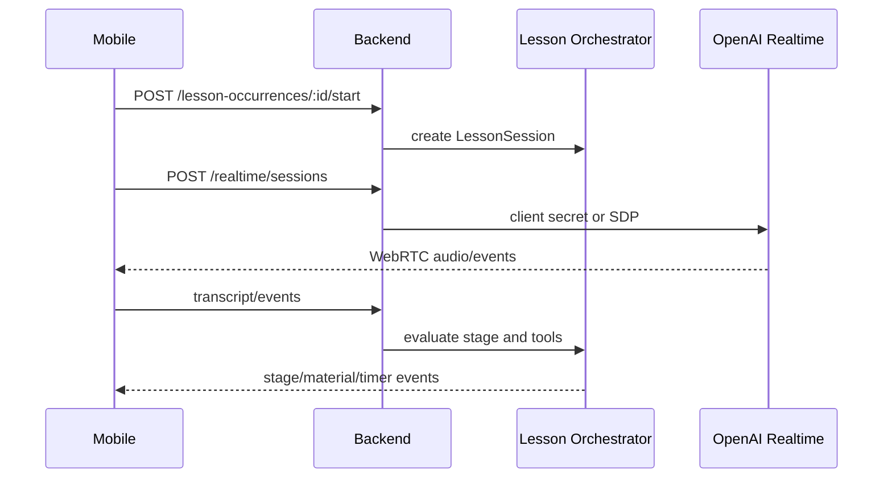

# Architecture

The API owns authoritative app, lesson schedule, lesson occurrence, notification delivery, and lesson session state. The worker owns scheduled occurrence materialization, push delivery, occurrence expiry, report jobs, review jobs, and outbox dispatch. Shared contracts prevent mobile, API, worker, and admin from redefining state machines or event payloads.

Provider-specific code sits behind interfaces:

- Realtime: mock, OpenAI unified SDP, OpenAI ephemeral secret.
- Push: mock, Firebase Cloud Messaging, APNs alert delivery through FCM on iOS.
- Billing: mock, RevenueCat or StoreKit/Google Play adapter.
- Pronunciation: disabled, mock, Azure-compatible provider.
- Analytics and crash reporting: adapter-based Firebase/Sentry.

## Scheduled Lesson Reminder Sequence

## Lesson Sequence

