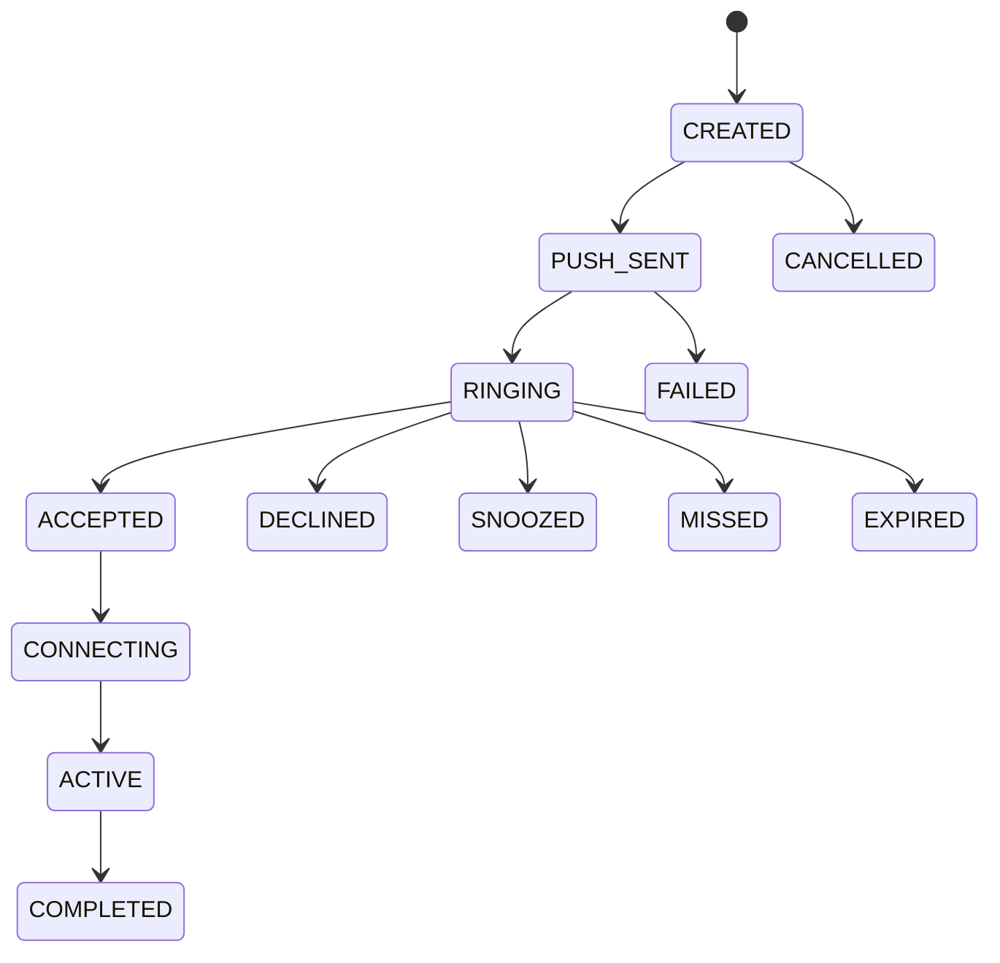

# Call Lifecycle

The worker creates one `CallAttempt` per due schedule, guarded by a Redis distributed lock. Calls expire after 45 seconds if unanswered. Snooze creates a new attempt for 10 minutes later. Mobile reconciles active and missed calls on app launch.
